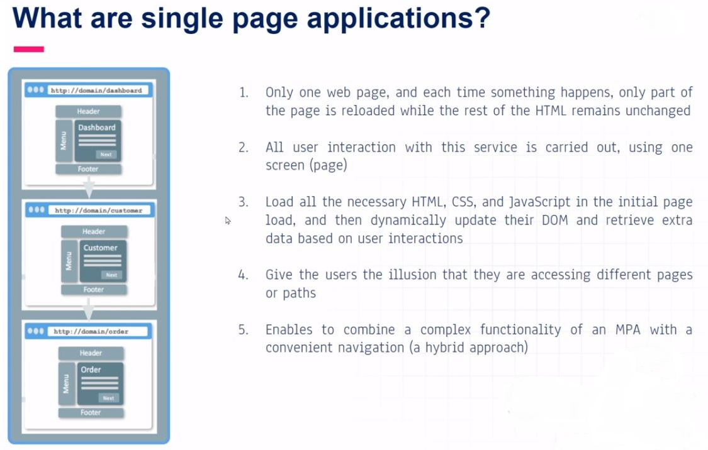
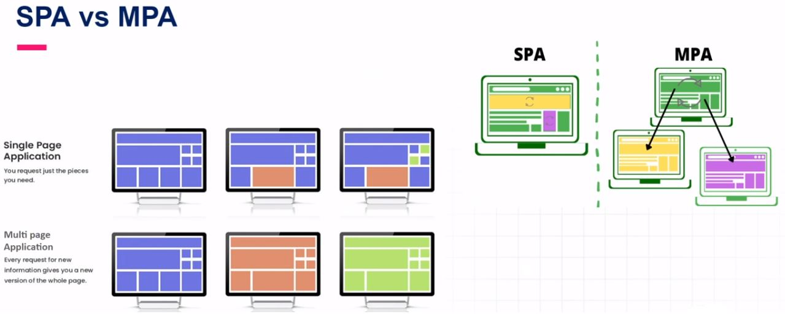
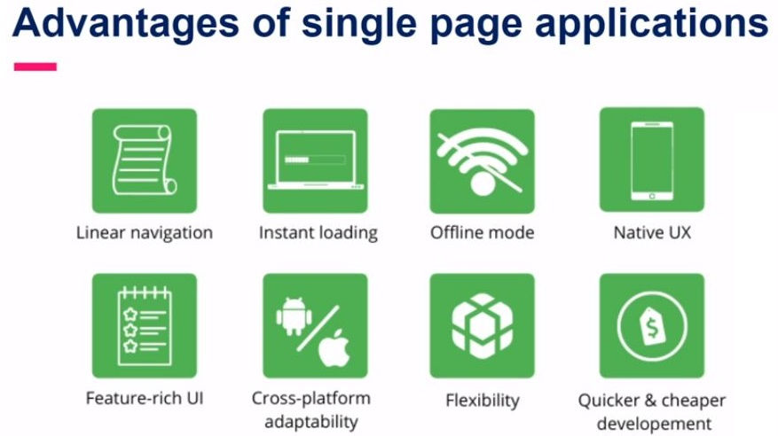
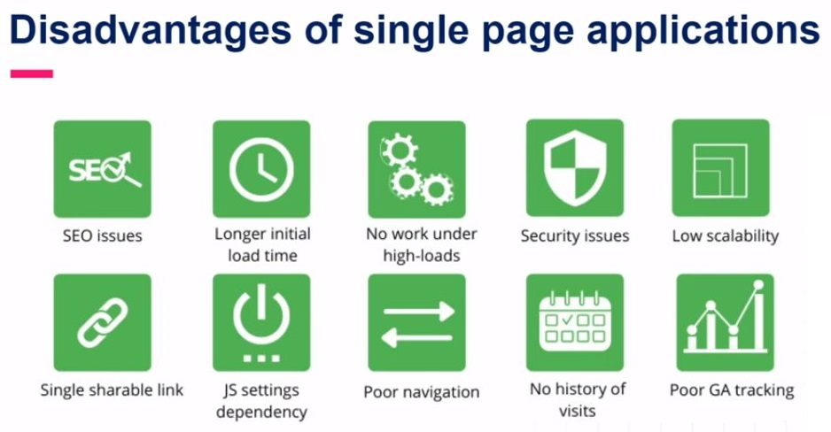
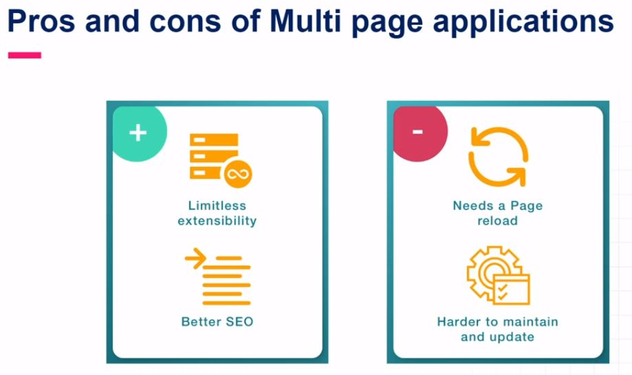
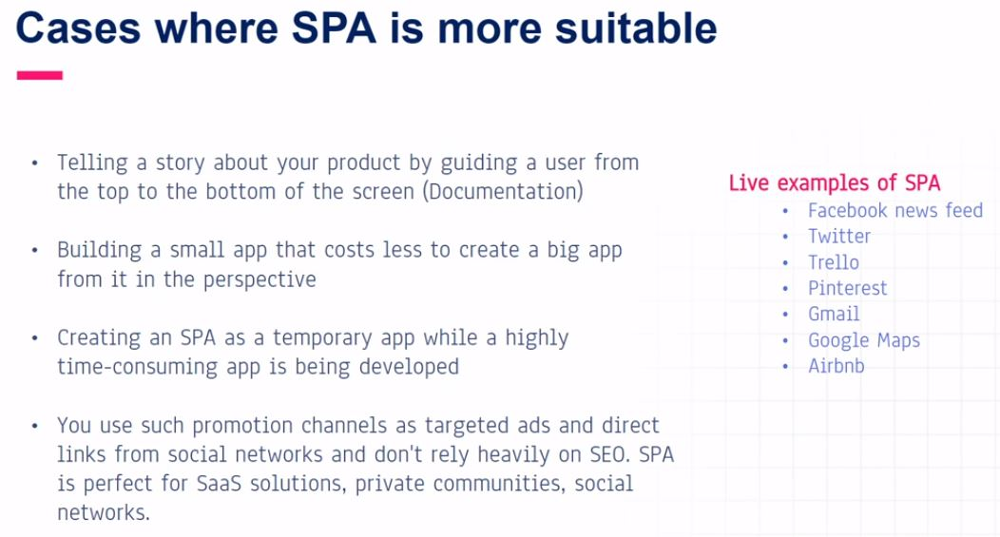
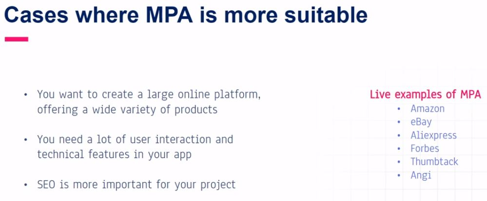
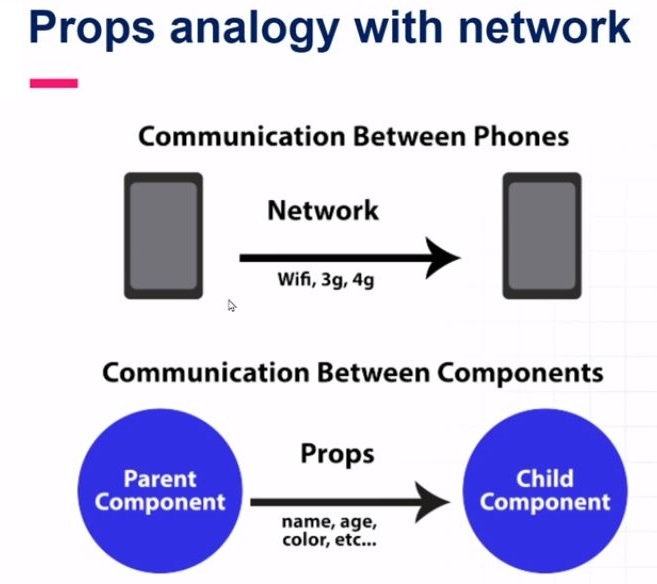
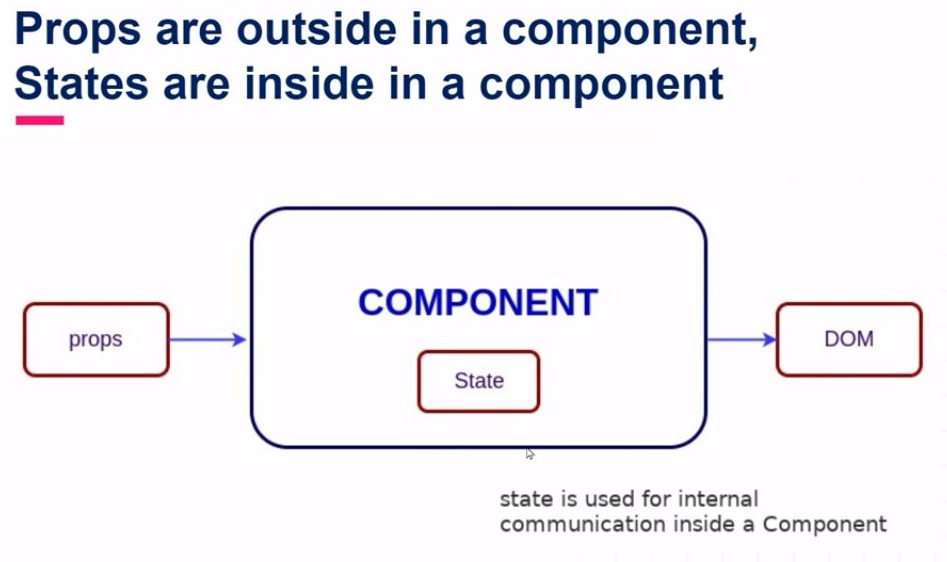

# Modern front-end core concepts :
## What are components in react?
- Building blocks of the user interface.
- Each component exists in the same space but works independently.
- All of the components are being marged in a parent component (the final UI)
- Splits UI into independent and reusable pieces.
- Accepts input called props (optional) and returns react element
- Re-usable having their own structure and methods.

## Types of component :
- Similar in look, defferent in data.
- Container component
- No common pattern, but breakdown for working purpose.
- Stand-alone component.

## Advantages of components :
- Code re-usability.
- Fast development.
- Design consistency.
- Maintainability(update just one component & get result in all spaces related to this component).

## What are single page applications ?

## SPA vs MPA :

||SPA|MPA|
|---|---|---|
|Structure|One page|Many pages|
|Shareable links|One link for the whole website|Many links|
|Loading|Longer initial loading, but after that each piece of content is instently refreshed.|A bit quicker initial loading, but then the app reloads the whole page on each user's action which is time-consuming.|
|Security|Needs more data protection on client side|Each page is protected on the server.|
|UI and UX|Looks and feels like a native app.|Must be adapted for mobile|
|Offline mode|Work with poor or non-existent internet.|Does not work without the internet.|
|SEO friendliness|Not SEO friendly, but optimization can be improved.|Work with all search engines.|
|Scalability|Defficult|Almost unlimited|

